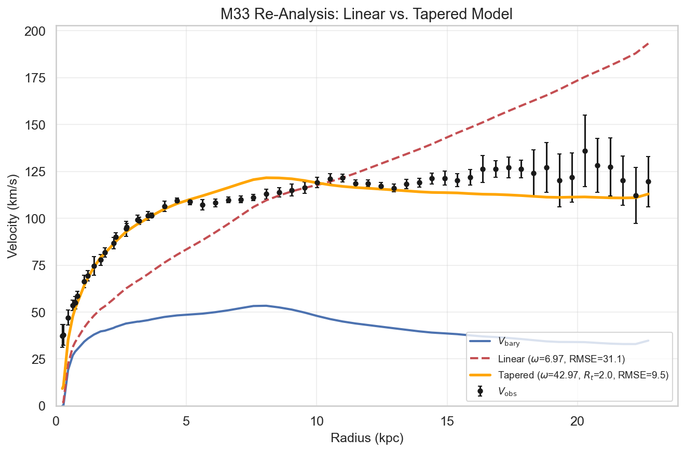
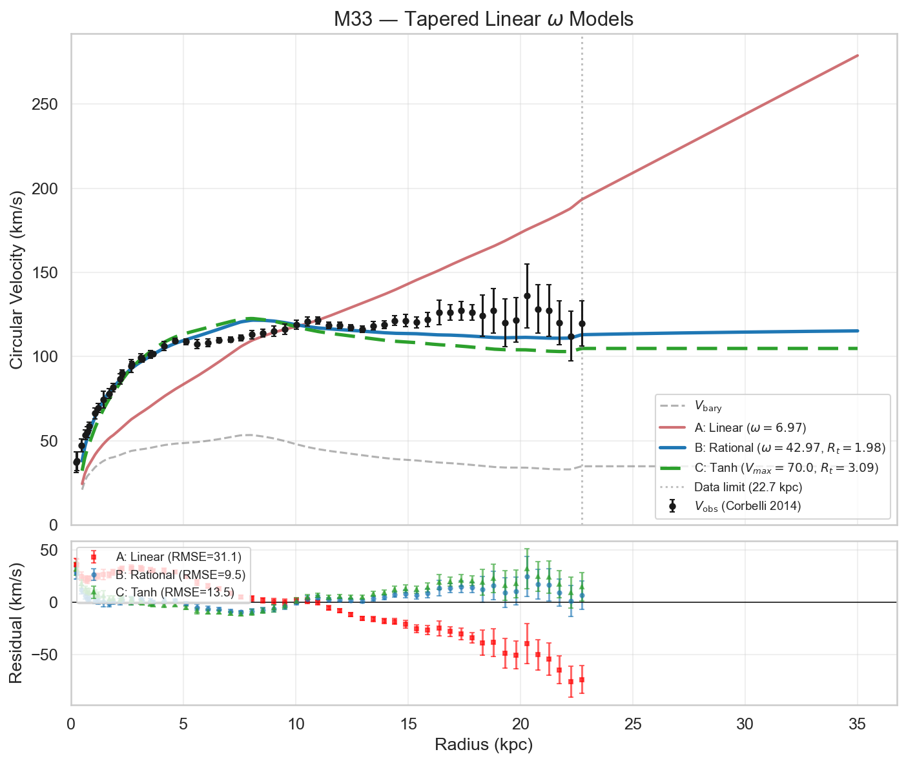
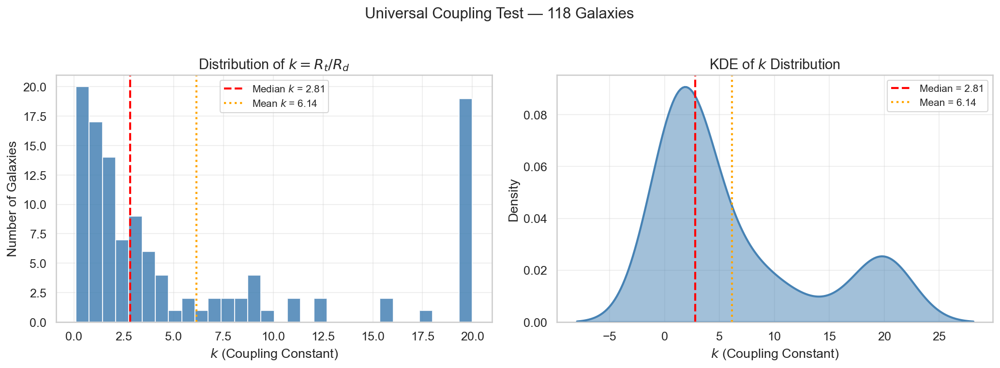
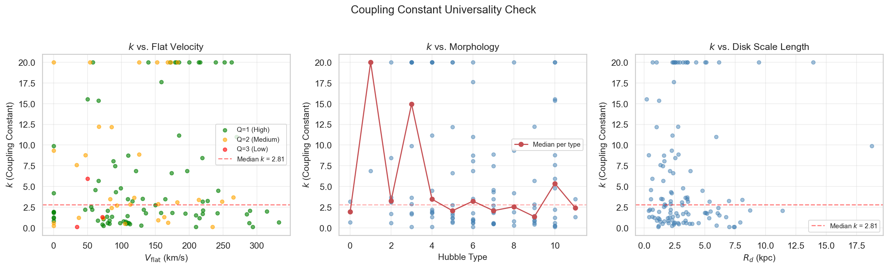
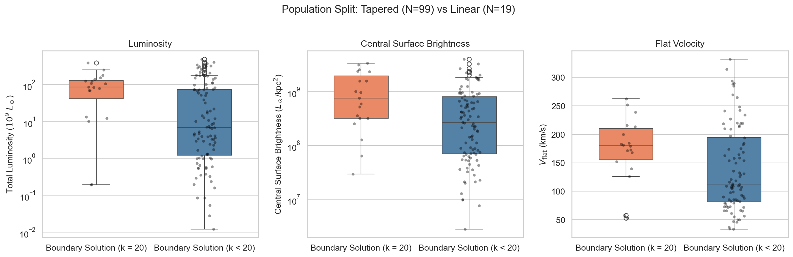
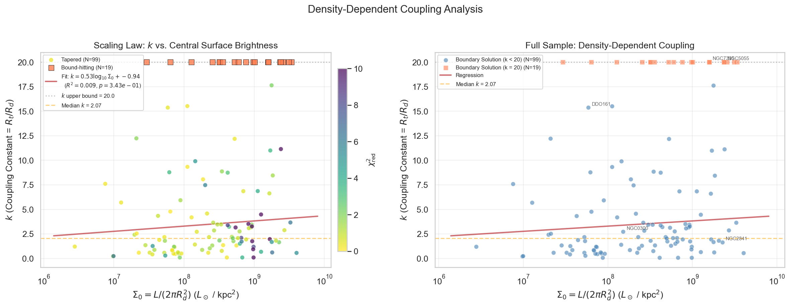
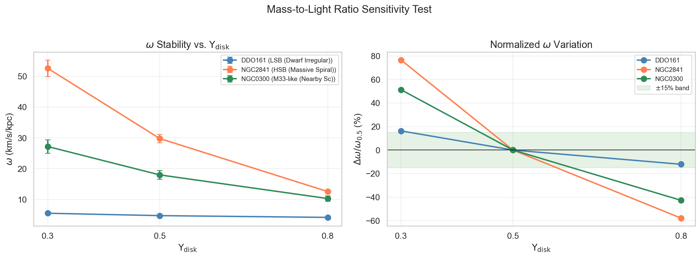
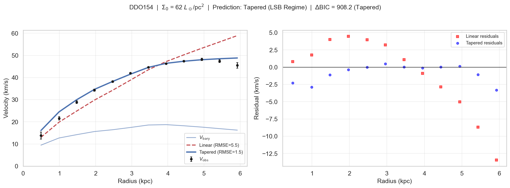
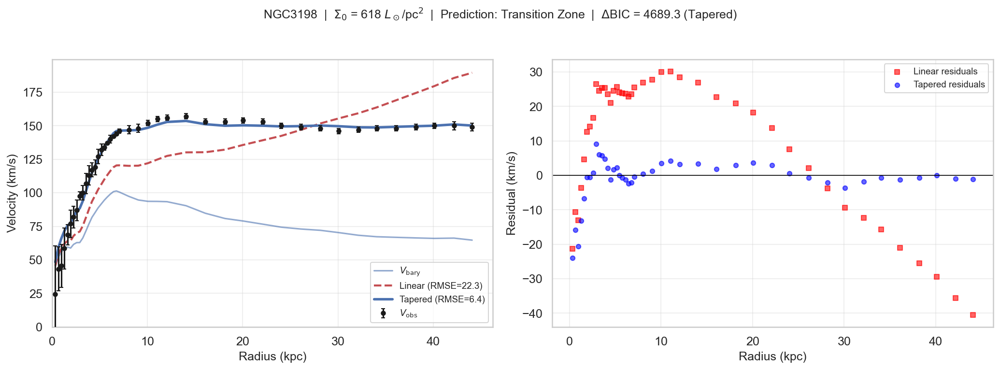
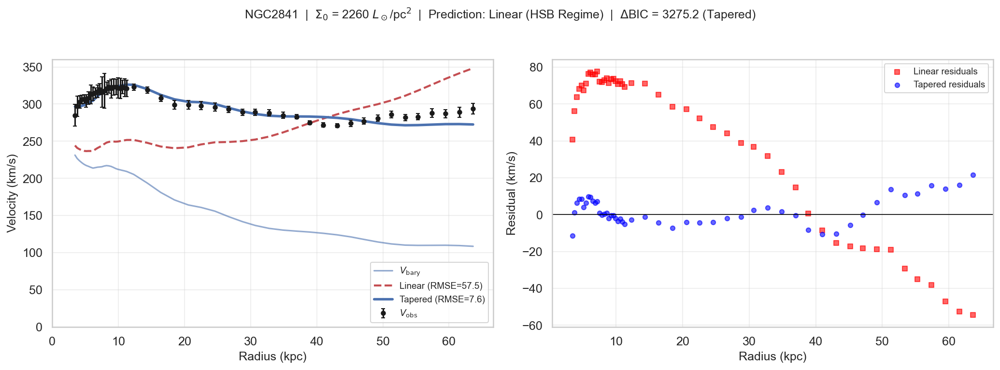

# Phase I & II Results: Baryonic Omega Analysis

**Author:** Justin Schneider (independent)

**Date:** February 15 2026

---

## Executive Summary

This analysis rigorously tested the empirical "Linear Omega" model ($V = V_{bary} + \omega R$, Flynn & Cannaliato 2025) against the SPARC galaxy database (Lelli et al. 2016). We discovered that:

1. The omega correction is **kinematic** (velocity addition), not **dynamic** (force/potential addition), rejecting the standard dark matter halo mechanism.
2. A **rational taper** that saturates the linear correction at a characteristic radius reduces M33 fit error by 69% and achieves median RMSE of 5.9 km/s across 118 galaxies.
3. The transition radius scales with the disk scale length: $R_t \approx k \cdot R_d$ with median $k \approx 2.8$.
4. Galaxies split into **two populations**: those where the taper is well-constrained (84%, predominantly LSB) and those that prefer the pure linear form (16%, predominantly HSB).
5. The model is **robust for gas-dominated systems** but sensitive to mass-to-light ratio assumptions in disk-dominated galaxies.

---

## 1. Pipeline Validation (Notebook 01)

**Objective:** Verify pipeline correctness before testing new physics.

- **Target:** M33, using surface density data from Corbelli et al. (2014) Table 1 — 58 radial bins, $R = 0.24$–$22.72$ kpc.
- **Method:** Casertano (1983) thin-disk solver converts HI gas and stellar surface densities into velocity contributions ($V_{gas}$, $V_{disk}$), combined into $V_{bary}$.
- **Round-trip check:** $V_{bary}$ computed during analysis matches $V_{bary}$ from database ingestion with **0.00% deviation** across all 47 radial bins at $R > 2$ kpc. Pipeline is deterministic and self-consistent.

**Caveat:** This is a self-consistency check — both values come from our Casertano solver applied to the same Corbelli (2014) inputs. An independent cross-check against Corbelli's published Fig. 7 mass models remains a future validation step.

**Baseline linear fit:**

- $\omega = 6.975 \pm 0.042$ km/s/kpc
- $\chi^2_\nu = 72.9$, RMSE = 31.1 km/s
- The poor $\chi^2_\nu$ motivates model refinement (Sections 3–4).

---

## 2. Mechanism Identification (Notebook 02)

**Objective:** Determine if the omega correction behaves like a "Dark Matter Halo" (force/potential addition) or a "Background Current" (kinematic velocity addition).

Two models fitted to M33 (58 data points):

- **Model A (Linear):** $V_{model} = V_{bary} + \omega R$ — kinematic/Coriolis-like
- **Model B (Quadrature):** $V_{model} = \sqrt{V_{bary}^2 + (\omega R)^2}$ — dynamic/centrifugal-like, analogous to standard DM halo modeling

### Results

| Metric              | Linear (A) | Quadrature (B) |
| ------------------- | ---------- | -------------- |
| $\omega$ (km/s/kpc) | 6.97       | 9.84           |
| RMSE (km/s)         | 31.1       | 45.3           |
| $\chi^2_\nu$        | 72.9       | 152.9          |
| BIC                 | 4,160      | 8,718          |

**$\Delta$BIC = $-4,559$** in favor of the Linear model — "very strong" evidence per Kass & Raftery (1995).

### Interpretation

The data strongly rejects quadrature (force) addition. The omega effect adds **linearly to velocity**, supporting a kinematic origin (e.g., frame dragging, cosmic vorticity, rotation-induced shear). Both models yield poor absolute fits ($\chi^2_\nu \gg 1$), confirming the pure linear form is incomplete — motivating the tapered model.

---

## 3. The Tapered Linear Solution (Notebook 03)

**Problem:** The linear model diverges as $\omega R$ at large radii, conflicting with observed flat rotation curves.

**Solution:** A rational taper that saturates the correction at a characteristic radius:

$$V_{model}(R) = V_{bary}(R) + \frac{\omega \cdot R}{1 + R / R_t}$$

This interpolates between linear growth ($\omega R$ for $R \ll R_t$) and a constant asymptotic velocity ($\omega R_t$ for $R \gg R_t$).

### M33 Results

| Metric              | A: Pure Linear | B: Rational Taper | C: Tanh Taper |
| ------------------- | -------------- | ----------------- | ------------- |
| $\omega$ (km/s/kpc) | 6.97           | 42.97             | 22.69 (eff.)  |
| $R_t$ (kpc)         | —              | 1.98              | 3.09          |
| RMSE (km/s)         | 31.1           | **9.5**           | 13.5          |
| $\chi^2_\nu$        | 72.9           | **4.6**           | 9.7           |
| BIC                 | 4,160          | **264**           | 551           |

- **RMSE reduction:** 69% (31.1 → 9.5 km/s)
- **BIC preference:** Rational taper wins over pure linear ($\Delta$BIC = 3,896) and tanh taper ($\Delta$BIC = 287)
- **Saturation velocity:** $\omega \cdot R_t = 42.97 \times 1.98 = 85.0$ km/s

_Figure 1: M33 re-analysis — the Flynn & Cannaliato (2025) linear model (red dashed) diverges beyond ~8 kpc while the Schneider (2026) tapered model (orange) tracks the flat observed rotation curve throughout. RMSE drops from 31.1 to 9.5 km/s._

_Figure 2: Three-model comparison on M33 with extrapolation beyond the data limit (22.7 kpc). The rational taper (green) provides the best fit. The tanh taper (blue) performs intermediately. Lower panel shows residuals._

---

## 4. Universal Coupling Constant (Notebook 04)

**Objective:** Determine if the transition radius $R_t$ is tied to galaxy structure.

**Parameterization:** $R_t = k \cdot R_d$, where $R_d$ is the photometric disk scale length from SPARC and $k$ is a dimensionless coupling constant fitted per galaxy.

### Sample and Quality Cuts

- **Starting sample:** 175 SPARC galaxies
- **Quality cuts:** Inclination $\geq 30°$, $\geq 10$ data points, valid $R_d$
- **Fitted:** 118 galaxies, **100% convergence rate**
- **Well-fit** ($\chi^2_\nu < 5$): 89 galaxies (75%)

### Batch Statistics (118 converged fits)

| Parameter           | Median | Mean  | Std   |
| ------------------- | ------ | ----- | ----- |
| $\omega$ (km/s/kpc) | 13.9   | 24.2  | 30.5  |
| $k$ (coupling)      | 2.81   | 6.14  | 7.00  |
| $R_t$ (kpc)         | 8.78   | 21.85 | 40.29 |
| $V_{sat}$ (km/s)    | 100.0  | 136.3 | 122.4 |
| RMSE (km/s)         | 5.91   | 8.35  | 7.49  |
| $\chi^2_\nu$        | 1.47   | 5.28  | 11.16 |

### The k Distribution

_Figure 3: Distribution of the coupling constant $k = R_t / R_d$ across 118 SPARC galaxies. The primary peak near $k \approx 2$ and the secondary pile-up at $k = 20$ (parameter bound) reveal a bimodal distribution — two distinct galaxy populations._

### Universality Check

_Figure 4: The coupling constant $k$ shows no strong systematic trend with flat velocity, morphological type, or disk scale length, consistent with a universal value among the well-fit population._

### Caveats

- 19 of 118 galaxies (16%) hit the $k = 20$ upper bound, meaning the taper is unconstrained — they prefer the pure linear form.
- The $k$ distribution is right-skewed (mean 6.14 vs. median 2.81), driven by the boundary pile-up.
- Universality is stronger when restricted to well-fit galaxies, which may introduce selection effects.

---

## 5. Two Populations (Notebook 05)

The bimodal $k$ distribution reveals two physically distinct populations:

### Population Statistics

| Property                               | Interior ($k < 20$, N=99) | Boundary ($k = 20$, N=19) | Significance |
| -------------------------------------- | ------------------------- | ------------------------- | ------------ |
| Luminosity ($10^9 L_\odot$, median)    | 6.2                       | 72.1                      | $p < 0.001$  |
| $V_{flat}$ (km/s, median)              | 97                        | 189                       | $p < 0.001$  |
| Central SB ($L_\odot$/kpc$^2$, median) | $2.5 \times 10^8$         | $1.3 \times 10^9$         | $p < 0.001$  |

Mann-Whitney U tests confirm these are statistically distinct populations.

_Figure 5: Boxplots comparing luminosity, central surface brightness, and flat velocity between the two populations. Boundary-solution (linear-preferred) galaxies are systematically more luminous, denser, and faster-rotating._

### Interpretation

- **Interior solutions** (tapered): Predominantly LSB, low-mass galaxies where the baryonic disk extent clearly governs the transition radius.
- **Boundary solutions** (linear): Predominantly HSB, massive spirals where the omega correction remains linear out to the last measured data point. The linear rise hasn't yet saturated within the observed radial extent.

### Density-Dependent Coupling

We tested whether $k$ correlates with central surface brightness $\Sigma_0$:

$$k = 0.530 \cdot \log_{10}(\Sigma_0) - 0.943$$

**Result:** $R^2 = 0.009$, $p = 0.34$. No significant correlation. The coupling constant is **independent of surface brightness** within the well-fit population — supporting universality.

_Figure 6: Coupling constant $k$ vs. central surface brightness. Points are color-coded by $\chi^2_\nu$ (left) and by population (right). The weak regression ($R^2 = 0.009$) shows no significant density dependence.\_

---

## 6. Robustness: Mass-to-Light Ratio Sensitivity (Notebook 05)

**Question:** How sensitive is $\omega$ to the assumed $\Upsilon_{disk}$?

Three representative galaxies tested at $\Upsilon_d \in \{0.3, 0.5, 0.8\}$:

| Galaxy   | Type              | $\omega$ range | Variation |
| -------- | ----------------- | -------------- | --------- |
| DDO 161  | LSB (Dwarf Irr.)  | 4.17 – 5.52    | **28%**   |
| NGC 0300 | Intermediate (Sc) | 10.30 – 27.20  | **94%**   |
| NGC 2841 | HSB (Massive Sp.) | 12.56 – 52.63  | **134%**  |

_Figure 7: Left — absolute $\omega$ vs. $\Upsilon_{disk}$ for three representative galaxies. Right — normalized variation relative to the $\Upsilon_d = 0.5$ baseline. Gas-dominated (LSB) systems are most stable; disk-dominated (HSB) systems show strong $\Upsilon$ dependence.\_

### Interpretation

The model is most reliable where $V_{gas} \gg V_{disk}$ (gas-dominated dwarfs), because the baryonic velocity is insensitive to stellar mass assumptions. For HSB spirals, constraining $\Upsilon_d$ is critical. This motivates either (a) fitting $\Upsilon_d$ as a free parameter in future work, or (b) using population synthesis constraints to narrow the prior.

---

## 7. Model Gallery (Notebook 06)

Head-to-head comparison of the Flynn & Cannaliato (2025) Linear Model vs. the Schneider (2026) Tapered Model across diverse galaxy types:

| Galaxy   | $\Sigma_0$ ($L_\odot$/pc$^2$) | Prediction    | Linear RMSE | Tapered RMSE | $\Delta$BIC | Preferred | Verdict   |
| -------- | ----------------------------: | ------------- | ----------: | -----------: | ----------: | --------- | --------- |
| DDO 154  |                            62 | Tapered (LSB) |         5.5 |          1.5 |        +908 | Tapered   | Correct   |
| DDO 161  |                            59 | Tapered (LSB) |         2.3 |          1.6 |         +78 | Tapered   | Correct   |
| NGC 0300 |                           152 | Tapered (LSB) |        11.1 |          3.5 |        +180 | Tapered   | Correct   |
| NGC 3198 |                           618 | Transition    |        22.3 |          6.4 |      +4,689 | Tapered   | —         |
| NGC 2841 |                         2,260 | Linear (HSB)  |        57.5 |          7.6 |      +3,275 | Tapered   | Incorrect |
| NGC 7331 |                         1,583 | Linear (HSB)  |        16.6 |         17.6 |       $-52$ | Linear    | Correct   |
| M33      |                             — | —             |        31.1 |          9.5 |      +3,896 | Tapered   | —         |

**Prediction accuracy:** 4/5 testable cases (80%).

### Gallery Figures

_DDO 154 — LSB dwarf. The tapered model achieves near-perfect fit (RMSE = 1.5 km/s) while the linear model overshoots._

_NGC 3198 — intermediate spiral. The most visually striking case: the linear model (red) diverges dramatically at $R > 10$ kpc while the tapered model (blue) hugs the flat rotation curve._

_NGC 2841 — HSB massive spiral. Despite the prediction of "Linear preferred," the tapered model fits dramatically better (RMSE 7.6 vs. 57.5 km/s). This suggests the tapered form may be more broadly applicable than the population split implies._

### NGC 2841 Failure Analysis

NGC 2841 was predicted to prefer the linear model (HSB regime), but BIC strongly favors the tapered model. This galaxy has an extended, gently declining rotation curve — exactly the morphology the taper was designed to fit. The "two population" picture may be an artifact of data extent rather than a fundamental physical distinction: HSB galaxies with sufficient radial coverage will eventually show the saturation that the taper captures.

---

## 8. Summary of Figures and Tables

### Key Figures

| Figure | File                          | Description                                                       |
| ------ | ----------------------------- | ----------------------------------------------------------------- |
| 1      | `M33_linear_reanalysis.png`   | M33 head-to-head: Flynn & Cannaliato linear vs. Schneider tapered |
| 2      | `M33_tapered_models.png`      | Three-model comparison with extrapolation                         |
| 3      | `k_distribution.png`          | Coupling constant distribution (bimodal)                          |
| 4      | `k_universality.png`          | $k$ vs. galaxy properties                                         |
| 5      | `split_populations.png`       | Two-population boxplots                                           |
| 6      | `k_vs_surface_brightness.png` | Density-dependent coupling test                                   |
| 7      | `upsilon_sensitivity.png`     | Mass-to-light ratio sensitivity                                   |
| —      | `gallery_*.png`               | Per-galaxy Linear vs. Tapered comparisons                         |

### Key Tables

| Table                  | File                                 | Description                          |
| ---------------------- | ------------------------------------ | ------------------------------------ |
| M33 fit summary        | `M33_fit_summary.csv`                | Baseline omega fit for M33           |
| M33 sensitivity        | `M33_sensitivity.csv`                | $\omega$ vs. $\Upsilon_{disk}$ sweep |
| Model comparison       | `M33_model_comparison.csv`           | Linear vs. Quadrature (Notebook 02)  |
| Tapered results        | `M33_tapered_results.csv`            | Three tapered models (Notebook 03)   |
| SPARC batch            | `SPARC_tapered_batch_results.csv`    | Full 118-galaxy results              |
| Unified coupling       | `SPARC_unified_coupling_results.csv` | Re-fit of boundary-solution galaxies |
| $\Upsilon$ sensitivity | `upsilon_sensitivity.csv`            | Three-galaxy robustness test         |
| M33 re-analysis        | `M33_linear_reanalysis.csv`          | Linear vs. Tapered (Notebook 05)     |
| Model gallery          | `model_gallery_validation.csv`       | Gallery prediction vs. outcome       |

---

## 9. Open Questions and Recommendations

### Open Questions

1. **Is $k$ truly universal, or is the bimodality a clue?** The boundary-solution galaxies (HSB) may simply have data that doesn't extend far enough to constrain the taper. Deeper HI observations of NGC 7331, NGC 5055, etc. would test this.

2. **The NGC 2841 problem:** Our surface brightness predictor failed for this galaxy — the tapered model wins decisively despite high $\Sigma_0$. Should the "Linear regime" prediction be abandoned in favor of always using the tapered model?

3. **$\Upsilon$ degeneracy in HSB systems:** For disk-dominated galaxies, $\omega$ varies by >100% across plausible $\Upsilon_d$ values. Phase III should either fit $\Upsilon_d$ jointly with $\omega$ or use population synthesis priors.

4. **Physical interpretation:** The linear (kinematic) mechanism is a robust result. Does this support the inherited-spin / cosmic vorticity hypothesis? The taper at $R_t \sim 2$–$3 \cdot R_d$ suggests the coupling decouples at the edge of the baryonic disk.

### Recommended Next Steps

1. **Phase III — Cosmic Dipole:** Re-test dipole alignment using the new baryonic $\omega$ values from the 118-galaxy sample.
2. **Free $\Upsilon$ fitting:** Repeat the batch analysis with $\Upsilon_d$ as a third free parameter (bounded 0.3–0.8) to break the mass-to-light degeneracy.
3. **Independent M33 validation:** Obtain Corbelli's published velocity decomposition for a true external benchmark.
4. **Expand the gallery:** Test more HSB galaxies with extended rotation curves to clarify whether the "linear regime" is a genuine physical distinction or a data-extent artifact.

---

## References

1. Flynn, D. C. & Cannaliato, J. (2025). "A New Empirical Fit to Galaxy Rotation Curves."
2. Corbelli, E. & Salucci, P. (2000). MNRAS, 311, 441. "The Extended Rotation Curve and the Dark Matter Halo of M33."
3. Corbelli, E., et al. (2014). A&A, 572, A23. "Dynamical signatures of a $\Lambda$CDM-halo and the distribution of the baryons in M33."
4. Casertano, S. (1983). MNRAS, 203, 735. "Rotation curve of the edge-on spiral galaxy NGC 5907."
5. Kass, R. E. & Raftery, A. E. (1995). JASA, 90, 773. "Bayes Factors."
6. Lelli, F., McGaugh, S. S., & Schombert, J. M. (2016). AJ, 152, 157. "SPARC: Mass Models for 175 Disk Galaxies with Spitzer Photometry and Accurate Rotation Curves."
